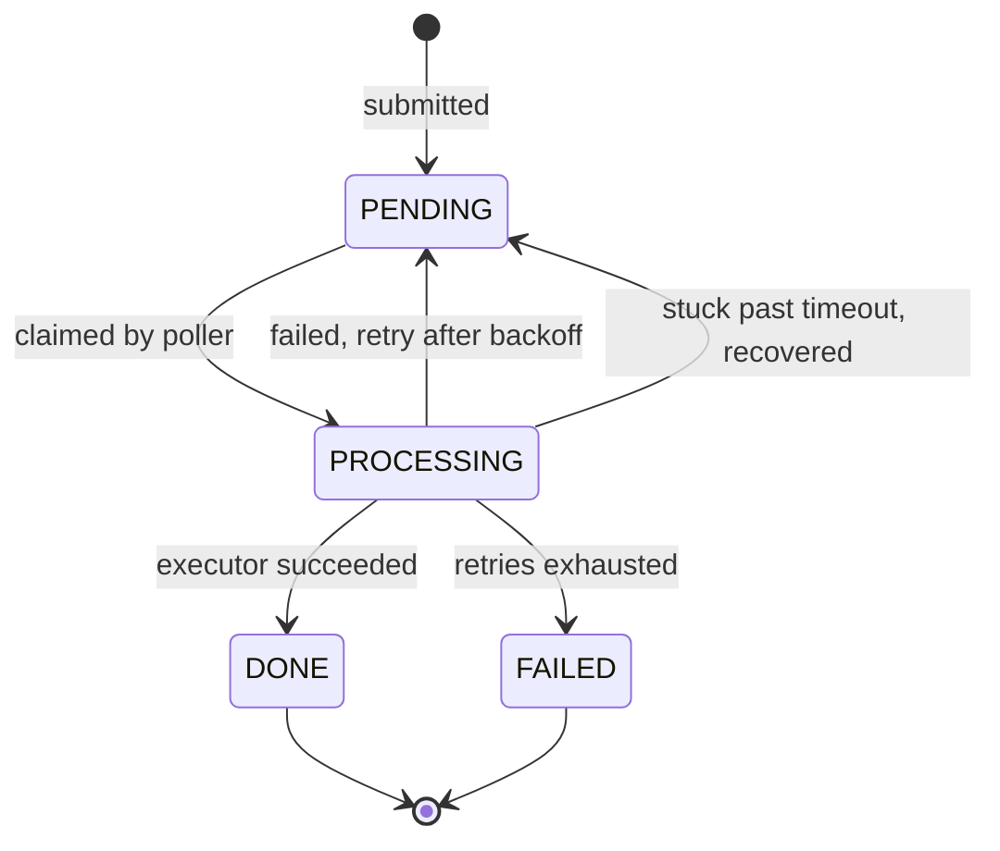

# Chronos

A delayed task scheduler. You POST a task with a time in the future, it gets executed then. Failures are retried with backoff, and tasks abandoned by a crashed instance get picked back up.

Built with Spring Boot and PostgreSQL.

## Why not just a cron job

The usual way to do this is a scheduled method that scans a table for rows that are due. That works until you run a second instance. Both poll, both read the same PENDING row before either writes a status back, and the task runs twice.

`SELECT ... FOR UPDATE` stops the double execution but makes the instances queue behind each other. `FOR UPDATE SKIP LOCKED` skips rows another transaction already holds instead of waiting on them, so instances split the work rather than taking turns.

That's the claim query:

```sql
    SELECT * FROM delayed_tasks
    WHERE status = 'PENDING' AND execute_at <= :now
    ORDER BY execute_at
    LIMIT :batchSize
    FOR UPDATE SKIP LOCKED
```

It runs in one transaction with the status update, so the lock is held for as short a time as possible.

## Retries and recovery

A failed task goes back to PENDING with a delay of `base * multiplier^(retryCount - 1)`. Defaults give 30s, 60s, 120s, then FAILED.

Backoff doesn't help if the process dies mid-execution. The task sits in PROCESSING, nothing holds a lock on it, and no poller will claim it again. So a second job sweeps tasks that have been PROCESSING past a timeout and runs them through the same failure path. A crash costs one retry, not the task.

## Task Lifecycle



## API

The REST API is served under `/api/tasks`.

### Submit a task

```http
POST /api/tasks
Content-Type: application/json
```

```json
{
  "payload": {
    "to": "recipient@example.com",
    "subject": "Reminder",
    "body": "Your scheduled reminder"
  },
  "executeAt": "2027-09-23T12:00:00"
}
```

The response status is `201 Created`.

```json
{
  "id": 1,
  "payload": {
    "to": "recipient@example.com",
    "subject": "Reminder",
    "body": "Your scheduled reminder"
  },
  "executeAt": "2027-09-23T12:00:00",
  "status": "PENDING",
  "retryCount": 0,
  "maxRetries": 3,
  "createdAt": "2027-09-23T11:59:00"
}
```

### Get a task

```http
GET /api/tasks/{id}
```

The response status is `200 OK` and uses the same task response shape. A missing task returns `404 Not Found`; invalid request fields return `400 Bad Request` with field errors.

Swagger UI is available at `/api/docs`.

## Configuration

| Property | Default | Notes |
|---|---|--|
| `chronos.scheduler.poll-interval-ms` | `5000` | delay between polls                    |
| `chronos.scheduler.batch-size` | `10` | tasks claimed per poll                 |
| `chronos.scheduler.recovery-interval-ms` | `60000` | delay between recovery sweeps          |
| `chronos.scheduler.stuck-task-timeout` | `2m` | how long PROCESSING is allowed to last |
| `chronos.retry.max-retries` | `3` | retry budget for new tasks             |
| `chronos.retry.backoff-base-seconds` | `30` | first retry delay                      |
| `chronos.retry.backoff-multiplier` | `2` | growth per retry                       |

Credentials come from env vars: `DB_USERNAME`, `DB_PASSWORD`, `MAIL_USERNAME`, `MAIL_PASSWORD`.

## Tech Stack

- Java 21
- Spring Boot 4.0.8
- Spring Data JPA
- Spring MVC
- Spring Mail
- PostgreSQL
- Springdoc OpenAPI
- Lombok
- Maven

## Requirements

- Java 21
- PostgreSQL
- Maven

Containerized setup is coming.

## Known limitations

- A claimed batch executes sequentially on the scheduler thread, so one slow task holds up the rest of its batch.
- Permanent failures like a malformed payload burn the full retry budget the same as an SMTP timeout would.
- No auth on the API.
- No tests yet apart from the generated context-load one.


